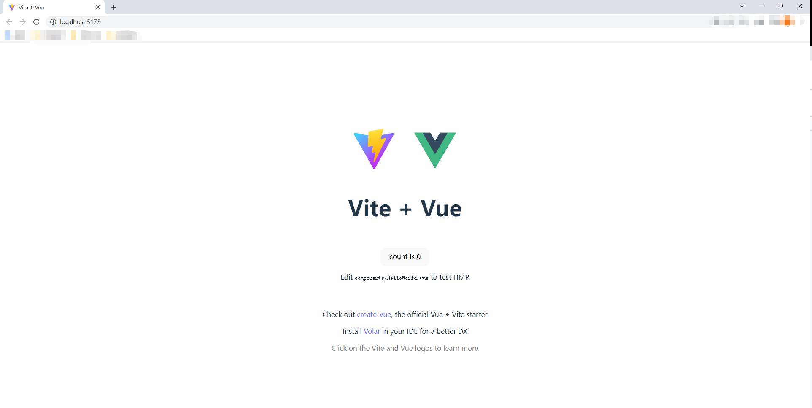

# Vue 3 + Vite

## 1.环境准备
**注意：vite需要node版本>=12.0.0**
### 1. 查看node环境

```
node -v
```


### 2. 查看npm环境

```
npm -v
```


## 2.搭建项目

### 1.创建项目

```
npm init vite@latest
```

### 2.输入项目名称---选择框架---选择js/ts语言等


### 3.创建成功后查看目录


## 3.运行项目

### 1.安装依赖

```
npm install
```

### 2.本地运行

```
npm run dev
```



## 4.插件配置unplugin-auto-import/vite

### 1.安装依赖

```
npm install unplugin-auto-import --save-dev
```

### 2.创建vite/plugins文件夹（vite文件夹和src文件夹同级），包含index.js和auto-import.js文件

auto-import.js文件：

```
export default function createAutoImport() {
    return autoImport({
        // 自动导入vue和vue-router,pinia相关函数
        imports: [
            'vue',
            'vue-router',
            'pinia'
        ]
    })
}

```

index.js文件：

```
import vue from '@vitejs/plugin-vue'

import createAutoImport from './auto-import'

export default function createVitePlugins(viteEnv, isBuild = false) {
    const vitePlugins = [vue()]
    vitePlugins.push(createAutoImport())
    return vitePlugins
}
```

现在vue组件中可以直接使用composition api，不需要再额外引入


## 5.集成vue-router

### 1.安装依赖

```
npm install vue-router
```

### 2.在src文件夹下创建rouer文件夹并创建index.js文件

```
import { createWebHashHistory, createRouter } from 'vue-router';

const router = createRouter({
    // createWebHistory：路由模式路径不带#号，生产环境下不能直接访问，需要nginx转发；createWebHashHistory：路由模式路径带#号
    history: createWebHashHistory(),
    // 路由
    routes: xxx,
    scrollBehavior(to, from, savedPosition) {
      if (savedPosition) {
        return savedPosition
      } else {
        return { top: 0 }
      }
    },
  });
  
export default router;
```

### 2.在router/index.js文件中添加路由

**注意：在src文件夹下已创建views/login/index.vue文件**

```
// 公共路由
export const constantRoutes = [
    {
        path: '/',
        redirect: '/login'
    },
    {
        path: '/login',
        component: () => import('../views/login/index.vue')
    }
]
```

### 4.在main.js文件中引入路由

```
import router from './router'

const app = createApp(App)
app.use(router)
```

## 6.集成状态管理器：pinia

### 1.安装依赖

```
npm install pinia
```

### 2.在src文件夹下创建store文件夹并创建index.js文件和modules/user.js（示例）

index.js文件

```js
const store = createPinia()

export default store
```

user.js文件

```js
const useUserStore = defineStore(
    'user',
    {
        state: () => ({}),
        actions: {}
    })

export default useUserStore
```

### 3.在main.js中引入


```
import store from './store'

const app = createApp(App)
app.use(store)
```

### 4.pinia和vuex的区别
1. pinia没有mutation，只有state,getters,action（同步、异步）
2. pinia也是默认存入内存中，如果需要本地存储，配置上要比vuex麻烦
3. pinia语法上比vuex更容易理解和使用，pinia完整的TypeScript支持
4. pinia没有modules配置，每一个独立的仓库都是defineStore生成处理的
5. pinia是轻量级的，适合于中小型应用；vuex是重量级的，适应于大规模、复杂的项目

## 7.封装axios

### 1.安装依赖

```
npm install axios
```

### 2.在src文件夹下创建utils/request.js文件用来封装axios

```
import axios from 'axios'

// 创建axios实例
const service = axios.create({
  // axios中请求配置有baseURL选项，表示请求URL公共部分
  baseURL: 'http://xxx',
  headers: {
    // 
  },
  // 超时
  timeout: 30000
})

// request拦截器
service.interceptors.request.use((config) => {
    return config
}, error => {
    Promise.reject(error)
})

// 响应拦截器
service.interceptors.response.use((res) => {
    return  Promise.resolve(res.data)
},
  error => {
})

export default service
```

## 8.配置vite.config.js

```js
import { defineConfig, loadEnv } from 'vite'
import createVitePlugins from './vite/plugins'
import path from 'path'

export default defineConfig(({ mode, command }) => {
  const env = loadEnv(mode, process.cwd())
  const { VITE_APP_ENV } = env
  return {
    base: VITE_APP_ENV === 'production' ? '/' : '/',
    plugins: createVitePlugins(env, command === 'build'),
    resolve: {
      alias: {
        // 设置路径
        '~': path.resolve(__dirname, './'),
        // 设置别名
        '@': path.resolve(__dirname, './src')
      },
      extensions: ['.mjs', '.js', '.ts', '.jsx', '.tsx', '.json', '.vue']
    },
    server: {
      // 设置服务启动端口号
      port: 8080,
      host: true,
      // 设置服务启动时自动打开浏览器
      open: true,
      // 配置代理转发
      proxy: {
        '/dev-api': {
          // 实际请求地址
          target: 'http://xxx',
          changeOrigin: true,
          rewrite: (p) => p.replace(/^\/dev-api/, '')
        }
      }
    }
  }
})

```


**基本的配置到这里就结束了，喜欢哪个UI框架自己安装依赖配置使用哦!!!**